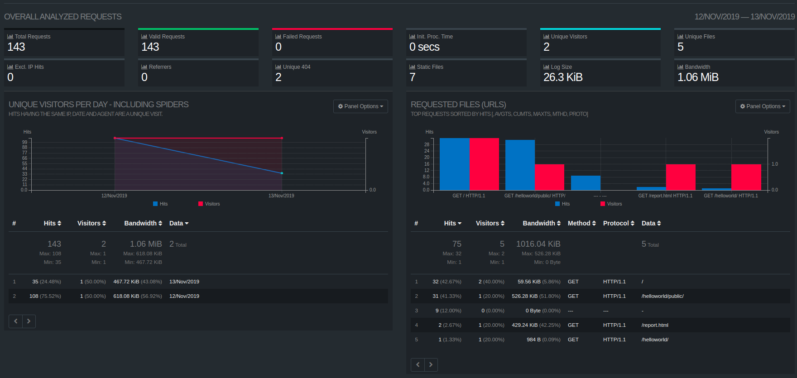

# Apache actividad 1

El servidor HTTP Apache es un servidor web HTTP de código abierto, para plataformas Unix, Microsoft Windows Macintosh...


# Sitio 1

Instalar servidor PHP:
```
sudo apt install php7.2
```
Habilitar módulo apache:
```
a2enmod php7.2
```

Creamos el directorio dónde estará el sitio php.
```
sudo mkdir /var/www/sitioPhp
```

Añadimos `Listen 82` a /etc/apache2/ports.conf

<br>


Creamos el fichero `/etc/apache2/sites-available/sitio-php.conf` con el siguiente contenido.
```
<VirtualHost *:82>
        ServerAdmin webmaster@localhost
        DocumentRoot /var/www/sitioPhp

        ErrorDocument 404 /404.html

        ErrorLog /etc/logs/sitioPhp.log

        LogFormat "%t %h %m %>s" PhpLogFormat
        CustomLog /etc/logs/sitioPhpCustom.log PhpLogFormat
</VirtualHost>
```

# Sitio 2
## Crear sitio
Primero debemos activar el módulo proxy y proxy_http.
```
sudo a2enmod proxy proxy_http
```

Añadimos `Listen 81` a /etc/apache2/ports.conf

Creamos un nuevo sitio en `/etc/apache2/sites-available/sitio-node.conf`
```html
<VirtualHost *:81>
        ServerAdmin webmaster@localhost
        DocumentRoot /var/www/sitioNode

        ProxyRequests off 
        ProxyPass / http://127.0.0.1:3000/ 
        ProxyPassReverse / http://127.0.0.1:3000/ 

        LogFormat "%h %l %u %t \"%r\" %>s %b" nodeLog
        CustomLog /etc/logs/sitioNode nodeLog
</VirtualHost>
```

## Directorio privado

Modificamos el fichero `/etc/apache2/apache2.conf`

    sudo nano /etc/apache2/apache2.conf

Y activamos la opción `AllowOverride All` al directorio `/var/www` para poder ccrear nuestros ficheros `.htacces`.

```html
<Directory /var/www>
        Options Indexes FollowSymLinks
        AllowOverride All
        Require all granted
</Directory>
```

Descargamos el paquete `apache2-utils`.

    sudo apt-get install apache2-utils

A continuación procedemos a crear los usuarios que tendran acceso. (Tenemos que añadir la opcion  `-c` en caso que el fichero no exista).

    sudo htpasswd -c /etc/apache2/.htpasswd user


Ahora creamos el directorio `public_files` y su fichero `.htaccess`.

    mkdir /var/www/sitioNode/public_files
    
    touch /var/www/sitioNode/public_files/.htaccess

Añadimos el siguente contenido en el fichero .htaccess.

```
AuthType Basic
AuthName "Restricted Files"

AuthBasicProvider file
AuthUserFile "/etc/apache2/.htpasswd"
Require user user
```

Cuando entremos al navegador nos pedirá el usuario y la contraseña.

# Investigación

A continuación vamos a instalar una herramienta de configuración de logs de apache (GoAcces).

Instalamos GoAcces con el siguiente comando.

    apt-get install goaccess


Para realizar una monitorización a tiempo real ejecutamos el siguiente comando:

    goaccess /var/log/apache2/access.log -o /var/www/html/report.html --log-format=COMBINED --real-time-html

El cual nos genera un fichero html en la ruta 'var/www/html/report.html' donde veremos el log '/var/log/apache2/access.log'

Esta es la pantalla que mostrará el navegador al acceder en http://localhost/report.html.


