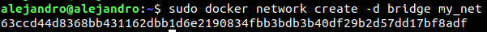
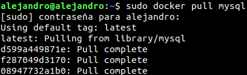
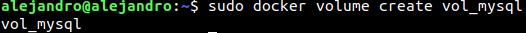
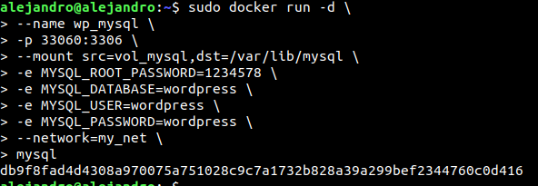
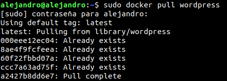
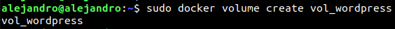
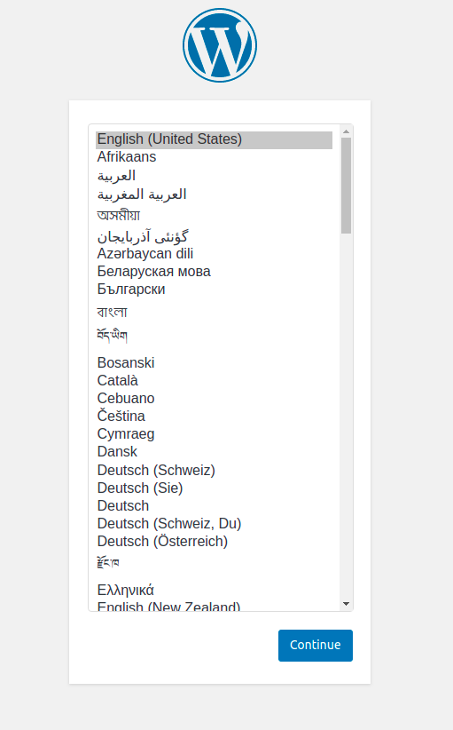
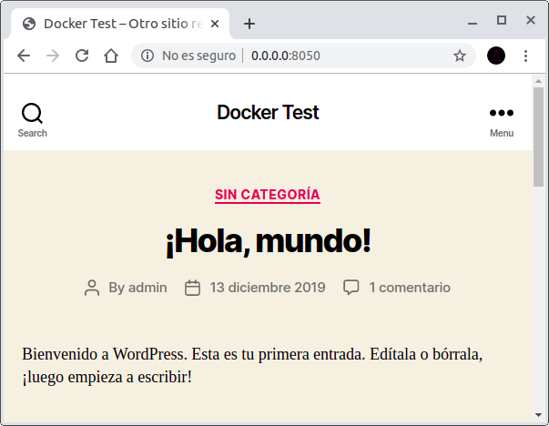

# Docker Actividad 1

## Configuración inicial

Creamos una red para permitir la comunicación con otros containers.

    docker network create -d bridge my_net



## MYSQL

Descargamos la imagen de MySQL con el siguiente comando 
    
    docker pull mysql



<hr>

Creamos un volumen llamado vol_mysql 
    
    docker volume create vol_mysql



A continuación ejecutamos la siguiente orden para arrancar un contenedor MySql con los parámetros desados.

```
sudo docker run -d \
--name wp_mysql \
-p 33060:3306 \
--mount src=vol_mysql,dst=/var/lib/mysql \
-e MYSQL_ROOT_PASSWORD=1234578 \
-e MYSQL_DATABASE=wordpress \
-e MYSQL_USER=wordpress \
-e MYSQL_PASSWORD=wordpress \
--network my_net \
mariadb
```




## WORDPRESS

Descargamos la imagen de Wordpress con el siguiente comando 
    
    docker pull wordpress



Creamos un volumen para wordpress con la siguiente orden 
    sudo docker volume create vol_wordpress



```
sudo docker run -d \
--name wordpress \
-p 8050:80 \
--mount src=vol_wordpress,dst=/var/www/html \
-e WORDPRESS_DB_HOST=wp_mysql \
-e WORDPRESS_DB_USER=wordpress \
-e WORDPRESS_DB_PASSWORD=wordpress \
--network my_net \
wordpress
```

A continuación tendremos Wordpress iniciado.





¡Al reiniciar los contenedores los datos se mantienen!

