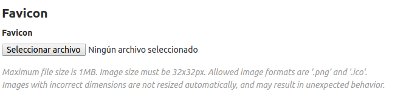

# Actividad gitlab server.
A continuación se muestra una guía para instalar y realizar algunas configuraciones básicas de Gitlab Server.

#### Instalar las dependencias de gitlab

``` 
sudo apt-get update
sudo apt-get install -y curl openssh-server ca-certificates
sudo apt-get install -y postfix
```

#### Instalar gitlab
```
sudo EXTERNAL_URL="http://gitlab.local" apt-get install gitlab-ee
```

#### Cambiar puerto de acceso
- Fichero /etc/gitlab/gitlab.rb


#### Impedir que usuarios nuevos puedan modificar su identificador. (Línea comentada por defecto)
- Fichero /etc/gitlab/gitlab.rb


#### Modificar el tiempo de expiración de la sesión.
A través de la web accedemos a  `Admin Area -> Settings -> General -> Account and limit` y modificamos el siguente campo:


#### Gestión por API.
Deberemos haber generado un token para el usuario administrador a través de la configuración del usuario en la web. Este token será añadido al header de cada consulta.

` User Settings -> Access Tokens ` 


- Alta
    - POST /api/v4/users
    ``` 
    {
        "email": "test@test.com",
        "name": "test",
        "password": "testtest",
        "username": "test"
    } 
    ```
- Modificación
    - PUT /api/v4/users/:id
- Borrar
    - DELETE /api/v4/users/:id

<br>

- Bloqueo
    - POST /api/v4/users/:id/block
- Desbloqueo
    - POST /api/v4/users/:id/unblock

<br>

- Establecer usuario como administrador.
    - PUT /api/v4/users/2
    ```
    {
	    "admin" : true
    }
    ```

<br>

- Creación de proyectos.
    - POST /api/v4/projects
    ```
    {
        "name" : "testProject"
    }
    ```

<br>

### Personalización
Para personalizar el aspecto accedemos a ` Admin area -> Appearance `
- Modificar la página de creación de un nuevo proyecto.


- Modificar el logo y la descripción de la pantalla de login.

    - Formato [GitLab Flavored Markdown](https://gitlab.com/help/user/markdown)
- Modificar el favicon de gitlab.


### Importar proyectos
Podemos importar un projecto a través de la web desde el menú "Import project" al momento de crear un nuevo proyeto.


A traves de la API:
- POST /api/v4/projects
```
{
    "name": "importProject",
    "import_url": "[URL DEL PROYETO]"
}
```