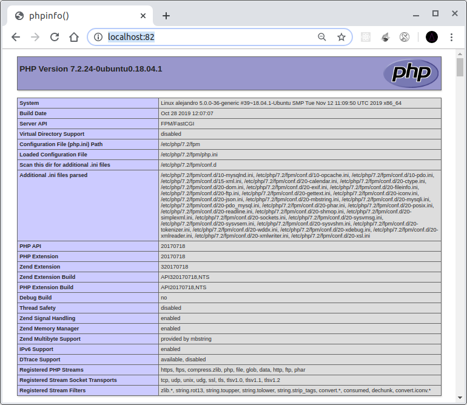
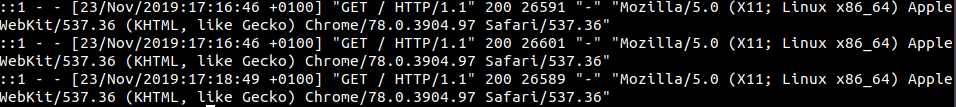
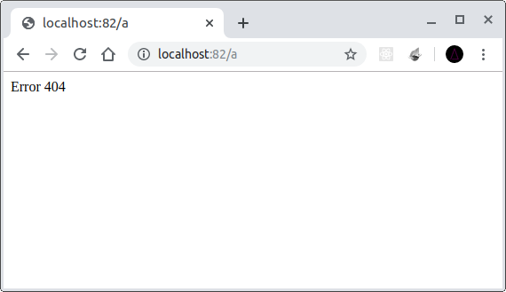
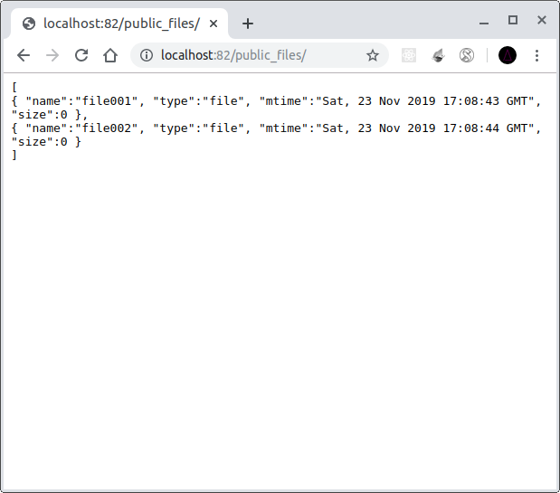
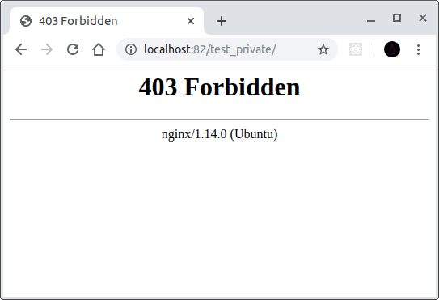
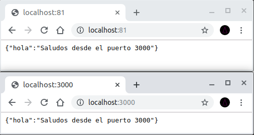
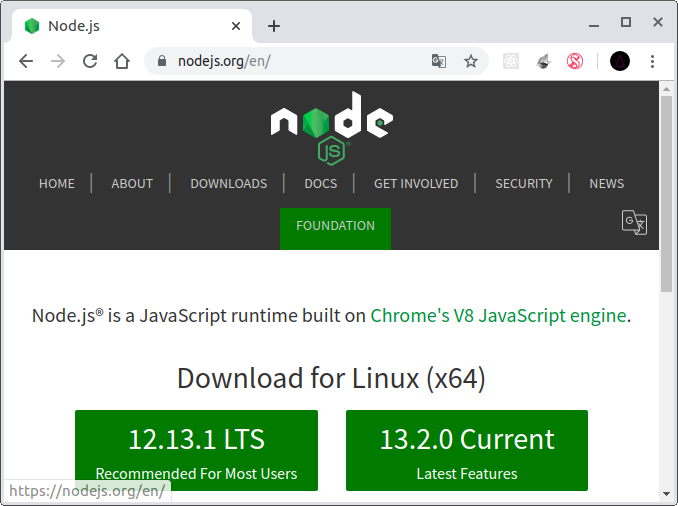

# Nginx actividad 1
Nginx ​es un servidor web ligero de alto rendimiento de software libre y multiplataforma.

Nginx fue inicialmente desarrollado con el fin de superar el rendimiento ofrecido por el servidor web Apache.

# Sitio 1
A continuación vamos a realizar la configuración necesaria para mostrar una página php.

En primer lugar tenemos que instalar el servidor php.

    sudo apt install php7.2

A continuación procedemos a crear el fichero `/etc/nginx/sites/available/misitiophp` con el siguiente contenido.
```
server {
    listen 82 default_server;
    listen [::]:82 default_server;

    root /var/www/sitioPhp;
    index index.php index.html index.htm index.nginx-debian.html;

    server_name localhost;

    location / {
        try_files $uri $uri/ =404;
    }

    location ~ \.php$ {
        include snippets/fastcgi-php.conf;
        fastcgi_pass unix:/run/php/php7.2-fpm.sock;
    }

    location ~ /\.ht { 
        deny all;
    }
}
```

Seguidamente creamos un enlace simbólico al fichero en la ruta `/etc/nginx/sites-enabled/`

    sudo ln -s /etc/nginx/sites-available/misitiophp /etc/nginx/sites-enabled/

Reiniciamos el servicio 

    sudo service nginx restart

Creamos un fichero de prueba en el directorio `/var/www/sitioPhp` (index.php) con el siguiente contenido.

``` php
<?php
    phpinfo();
```
Y accedemos a la URL http://localhost:82/ desde el navegador para comprobar que funciona.

;

## Configurar directorio de logs

Para añadir el log al fichero que deseamos tenemos que añadir lo siguiente al fichero `/etc/nginx/sites-available/misitiophp` :
```
server {
    access_log /etc/logs/sitioPhp/sitioPhp.log
    . . .
}
```

Despues de reiniciar el servicio podremos ver los logs en el directorio indicado.



## Compresión de ficheros

Para comprimir los ficheros que superan los 80KB añadimos las siguientes líneas al fichero `/etc/nginx/sites-available/misitiophp`
```
server {
    gzip on;
    gzip_min_length 80000;
    . . .
}
```

## Error 404 personalizado

Para personalizar nuestra página de error 404 necesitaremos crear el directorio y el fichero html a mostrar.
```
mkdir /var/www/errores
echo "Error 404" > /var/www/errores/404.html
```

Seguidamente modificamos el fichero `/etc/nginx/sites-available/misitiophp`
```
server {
    error_page 404 /404.html;
    location = /404.html {
            root /var/www/errores;
            internal;
    }
    . . . 
}
```

Después de recargar nos mostrará el fichero creado.



## Listar ficheros

Primero crearemos el directorio y los ficheros a listar.
``` 
mkdir /var/www/sitioPhp/public_files
touch /var/www/sitioPhp/public_files/file001
touch /var/www/sitioPhp/public_files/file002
````

Seguidamente añadimos al fichero `/etc/nginx/sites-available/misitiophp` lo siguiente.

```
server {
    location /public_files {
        autoindex on;
        autoindex_format json;
    }
    . . . 
}
```

Ya podremos ver el listado desde el navegador.



## Directorios privados

En primer lugar creamos un directorio de prueba.
```
mkdir /var/www/sitioPhp/test_private
echo private > /var/www/sitioPhp/test_private/index.html
```

Después añadimos los parámetros en `/etc/nginx/sites-available/misitiophp`.
```
server {
    location ~ private {
        deny all;
        return 403;
    }
    . . . 
}
```

Finalmente, después de reiniciar el servicio comprobamos el resultado en el navegador.



# Sitio 2
A continuación crearemos un sitio que nos permita acceder a una aplicación que esté ejecutandose en el puerto 3000 de nuestra máquina.

Para ello creamo el fichero `/etc/nginx/sites-available/segundositio`


    touch /etc/nginx/sites-available/segundositio

Con el contenido siguiente:
```
server {
    listen 81 default_server;
    listen [::]:81 default_server;

    root /var/www/sitioNode;
    index index.php index.html index.htm index.nginx-debian.html;

    server_name localhost;

}
```

## Redirección de puertos
Añadimos a la configuración del sitio:
```
server {
    location / {
        proxy_pass http://127.0.0.1:3000;
    }
    . . .
}
```

Después de recargar el servicio podremos comprobar el resultado desde el navegador.



## Directorio de logs

Añadimos a nuestro sitoi lo siguiente:
```
server {
    access_log /etc/logs/sitioNode/sitioPhp.log
    . . .
}
```


## Error 404

Añadimos al fichero:
```
server {
    error_page 404 /404.html;
    location = /404.html {
            root /var/www/errores;
            internal;
    }
    . . . 
}
```

## Redirección en documentación.
Para realizar una redirección necesitaremos añadir lo siguiente a la configuración:
```
server {
    location /documentacion {
        return 301 https://nodejs.org/en/;
    }
}
```

Comprobamos la redirección en el navegador.

 

->


